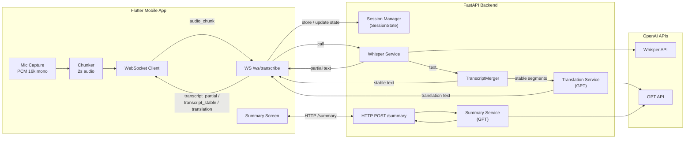
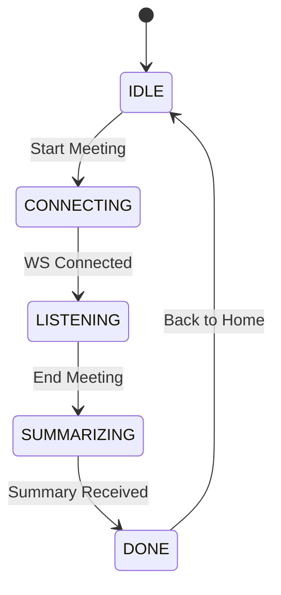

# Architecture & Flow (MVP)

This document describes the **end-to-end architecture** and **runtime flow** of the MeetLens MVP.

Goal: make it easy to reason about how audio goes from the microphone → transcript → translation → summary, and how Flutter and FastAPI interact.

---

## 1. High-Level Architecture

MeetLens MVP consists of:

- **Mobile App (Flutter)**
    - Captures microphone audio (including what comes from laptop speakers in the room)
    - Chunks audio (e.g., every 2 seconds)
    - Sends audio chunks via WebSocket to backend
    - Receives live transcript & translation via WebSocket
    - Calls HTTP summary endpoint at the end
    - Renders UI: live subtitles, translation, and post-meeting summary
- **Backend (FastAPI)**
    - Exposes WebSocket endpoint `/ws/transcribe`
    - Exposes HTTP endpoint `POST /summary`
    - Manages per-session state (SessionState)
    - Sends audio chunks to OpenAI Whisper for transcription
    - Merges partial transcriptions into stable text (TranscriptMerger)
    - Sends stable segments to translation (GPT or similar)
    - Streams `transcript_partial`, `transcript_stable`, and `translation` back to the client
    - Generates meeting summary at the end using GPT
- **External AI Services (OpenAI)**
    - Whisper (Speech-to-Text)
    - GPT (translation + summary)

---

## 2. High-Level Diagram (Mermaid)



---

## 3. Runtime Flow – Step by Step

### 3.1. Start of Meeting

1. **User opens MeetLens** and taps **“Start Meeting”**.
2. Flutter app:
    - Requests microphone permission if not already granted.
    - Generates a `session_id` (UUID v4).
    - Opens a WebSocket connection to `/ws/transcribe`.
3. When WS connection is established, client enters **LISTENING** state.

---

### 3.2. Audio Capture & Chunking (Client)

1. Flutter starts **continuous microphone capture** in 16 kHz mono PCM format.
2. A timer (or stream transformer) groups audio into **2-second chunks**.
3. For each chunk:
    - Convert raw bytes to Base64 string.
    - Increment `chunk_id` (1, 2, 3, ...).
    - Send `audio_chunk` message over WebSocket:
    
    ```json
    {
      "type": "audio_chunk",
      "session_id": "<uuid>",
      "chunk_id": 1,
      "audio_format": "pcm_s16le_16k_mono",
      "data": "BASE64_AUDIO"
    }
    
    ```
    
4. The app continues to send chunks until the user taps **“End Meeting”**.

---

### 3.3. WebSocket Handling & Session State (Backend)

1. When a client connects to `/ws/transcribe`, backend:
    - Creates (or retrieves) a `SessionState` for the `session_id`.
2. For each `audio_chunk`:
    - Base64 decode → `bytes`
    - Wrap into Whisper-compatible audio input (e.g., temporary file or memory buffer).
    - Call **Whisper API**.
    - Receive transcript text for that chunk.
    - Pass transcript text to **TranscriptMerger** with the session’s `SessionState`.
3. TranscriptMerger returns:
    - `partial_text` (optional)
    - `stable_segment` (optional)
4. Backend sends messages back to client:
    - If `partial_text` available → send `transcript_partial`.
    - If `stable_segment` available → send `transcript_stable`.
5. For each `stable_segment`:
    - Send it to **TranslationService**.
    - TranslationService calls GPT to translate that segment.
    - When translation is ready → send `translation` message.

---

### 3.4. TranscriptMerger Behavior (Conceptual)

`TranscriptMerger` is responsible for:

- Avoiding word splits at chunk boundaries.
- Removing duplicated words between chunks.
- Emitting **stable** segments when it is confident a sentence/segment has finished.

Conceptual logic:

1. Keep `tail_words` (last N words from `last_stable_text`).
2. When new chunk `raw_text` comes:
    - Split into tokens (words).
    - Find the longest overlap between `tail_words` and the beginning of `raw_text`.
    - Remove duplicate overlap portion.
    - Append the new unique words to `full_transcript`.
3. Detect sentence boundary when `.` / `?` / `!` or long pause indicator appears.
4. When a sentence is considered **closed**:
    - Emit this sentence as `stable_segment`.
    - Update `last_stable_text` and `tail_words`.

The client only knows about `transcript_partial` and `transcript_stable`; internal merging details are opaque.

---

### 3.5. Translation Flow

1. Every time `TranscriptMerger` emits a `stable_segment` (e.g., a full sentence), backend calls **TranslationService**.
2. TranslationService:
    - Builds a short prompt for GPT: "Translate this sentence from [source_lang] to [target_lang]".
    - Sends the segment to GPT.
    - Receives translated text.
3. Backend immediately sends a `translation` message over WebSocket:
    
    ```json
    {
      "type": "translation",
      "session_id": "<uuid>",
      "text": "Translated sentence here."
    }
    
    ```
    
4. Client appends this translated text to the translation view.

---

### 3.6. End of Meeting & Summary

1. User taps **“End Meeting”** in the app.
2. Client:
    - Stops microphone capture.
    - Stops sending new `audio_chunk` messages.
    - Sends a final `end_session` message over WebSocket:
    
    ```json
    {
      "type": "end_session",
      "session_id": "<uuid>"
    }
    
    ```
    
3. The app now has the full `stableTranscript` string locally.
4. Client calls `POST /summary` with:
    
    ```json
    {
      "session_id": "<uuid>",
      "full_transcript": "...full merged transcript...",
      "language": "tr"
    }
    
    ```
    
5. Backend SummaryService:
    - Builds a structured summarization prompt for GPT.
    - Asks GPT to produce:
        - Short overview (2–5 sentences)
        - Action items (bullet list)
        - Decisions (bullet list)
    - Returns `SummaryResponse`.
6. Client navigates to **Summary Screen** showing:
    - Full transcript (scrollable)
    - Summary overview paragraph
    - Action items list
    - Decisions list

---

## 4. Client State Machine (Simplified)



- **IDLE**: App is on home screen.
- **CONNECTING**: WebSocket being established.
- **LISTENING**: Audio capture + chunk streaming + live transcript/translation.
- **SUMMARIZING**: Waiting for `/summary` HTTP response.
- **DONE**: Summary shown.

---

## 5. Backend Components

### 5.1. WebSocket Controller

Responsibilities:

- Handle connection open/close
- Parse incoming JSON messages
- Route `audio_chunk` and `end_session` to appropriate services
- Stream back `transcript_*` and `translation` messages

### 5.2. Session Manager

Responsibilities:

- Maintain in-memory `SessionState` for each `session_id`
- Provide basic API: `get_or_create(session_id)`
- Optionally clean up old sessions after timeout

### 5.3. Whisper Service

Responsibilities:

- Take raw audio bytes + `audio_format`
- Call OpenAI Whisper API
- Return recognized text

### 5.4. TranscriptMerger

Responsibilities:

- Maintain text consistency across audio chunks
- Avoid duplicates / splits
- Detect stable segments (sentences)

### 5.5. Translation Service

Responsibilities:

- Take stable segment and language info
- Call GPT to translate
- Return translated text

### 5.6. Summary Service

Responsibilities:

- Take full transcript (string)
- Build summarization prompt
- Call GPT
- Return structured summary object

---

## 6. Non-Functional Considerations (MVP)

- **Latency:**
    - Acceptable if transcript/translation appears within ~1–2 seconds.
    - Optimizations (batching, streaming Whisper, etc.) can come later.
- **Stability:**
    - The system should handle at least 30–60 minutes of continuous meeting without crashing.
- **Error Handling:**
    - If a chunk fails, log it and continue with the next chunks.
    - If summary fails, show a graceful fallback in the app (e.g., transcript only).
- **Scalability:**
    - MVP is single-user / low-traffic; no heavy scaling required yet.

---

## 7. Future Extensions (Architecture Hooks)

The current architecture allows for future improvements without major redesign:

- Add authentication (tokens attached to WS + HTTP calls).
- Add usage tracking and per-user rate limiting.
- Replace in-memory `SessionState` with Redis for horizontal scaling.
- Support on-device Whisper for “Pro/Offline” mode.
- Add diarization by plugging a speaker-detection model before/after Whisper.

For now, the MVP architecture is intentionally **simple, linear, and focused** on proving the core experience:

> Phone on the table → live transcript + translation → clear summary at the end.
>