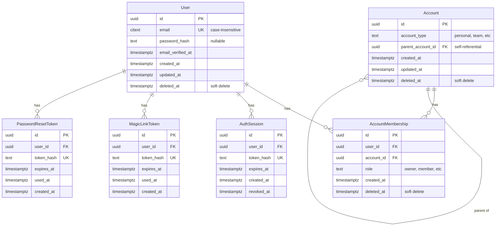

# MeetLens Database Schema Diagram

## Entity Relationship Diagram



## Simplified View

```
┌─────────────────┐
│      User       │
│  - email (UK)   │
│  - password_hash│
│  - deleted_at   │
└────────┬────────┘
         │
         │ 1:N
         │
┌────────▼─────────────┐
│ AccountMembership    │
│  - role              │
│  - deleted_at        │
└────────┬─────────────┘
         │
         │ N:1
         │
┌────────▼────────┐
│    Account      │
│  - account_type │
│  - deleted_at   │
└─────────────────┘
```

## Authentication Flow Diagram

```
┌─────────────────────────────────────────────────────────────┐
│                        User                                 │
│                          │                                  │
│                          │ creates                          │
│                          ▼                                  │
│  ┌──────────────────────────────────────────────┐          │
│  │          Authentication Tokens               │          │
│  ├──────────────────────────────────────────────┤          │
│  │                                              │          │
│  │  ┌────────────────────┐                     │          │
│  │  │  MagicLinkToken    │                     │          │
│  │  │  - token_hash (UK) │                     │          │
│  │  │  - expires_at      │                     │          │
│  │  │  - used_at         │                     │          │
│  │  └────────────────────┘                     │          │
│  │                                              │          │
│  │  ┌────────────────────┐                     │          │
│  │  │PasswordResetToken  │                     │          │
│  │  │  - token_hash (UK) │                     │          │
│  │  │  - expires_at      │                     │          │
│  │  │  - used_at         │                     │          │
│  │  └────────────────────┘                     │          │
│  │                                              │          │
│  └──────────────────────────────────────────────┘          │
│                          │                                  │
│                          │ creates after token consumed     │
│                          ▼                                  │
│  ┌──────────────────────────────────────────────┐          │
│  │            AuthSession                       │          │
│  │  - token_hash (UK)                           │          │
│  │  - expires_at                                │          │
│  │  - revoked_at                                │          │
│  └──────────────────────────────────────────────┘          │
└─────────────────────────────────────────────────────────────┘
```

## Signup Flow

```
1. User submits email + password
   │
   ▼
2. Create User (email, password_hash)
   │
   ▼
3. Create Account (type='personal')
   │
   ▼
4. Create AccountMembership (user_id, account_id, role='owner')
   │
   ▼
5. Return user_id, account_id
```

## Magic Link Flow

```
1. User requests magic link (email)
   │
   ▼
2. Find User by email
   │
   ▼
3. Create MagicLinkToken (token_hash, expires_at)
   │
   ▼
4. Send email with raw token
   │
   ▼
5. User clicks link
   │
   ▼
6. Verify MagicLinkToken (check expires_at, used_at)
   │
   ▼
7. Mark token as used (set used_at)
   │
   ▼
8. Create AuthSession (token_hash, expires_at)
   │
   ▼
9. Return session token to client
```

## Password Reset Flow

```
1. User requests password reset (email)
   │
   ▼
2. Find User by email
   │
   ▼
3. Create PasswordResetToken (token_hash, expires_at)
   │
   ▼
4. Send email with raw token
   │
   ▼
5. User submits new password + token
   │
   ▼
6. Verify PasswordResetToken (check expires_at, used_at)
   │
   ▼
7. Update User.password_hash
   │
   ▼
8. Mark token as used (set used_at)
   │
   ▼
9. Return success
```

## Soft Delete Behavior

```
┌─────────────────────────────────────────────────┐
│  Soft Delete: Set deleted_at = now()            │
│                                                 │
│  NO CASCADE:                                    │
│  - User soft delete → Memberships remain        │
│  - Account soft delete → Memberships remain     │
│  - Membership soft delete → User/Account remain │
│                                                 │
│  Records are NEVER physically deleted (MVP)     │
│  Orphaned records are allowed by design         │
└─────────────────────────────────────────────────┘
```

## Indexes

### users
- `id` (PK)
- `email` (UNIQUE)
- `ix_users_email_active` (UNIQUE, WHERE deleted_at IS NULL)

### accounts
- `id` (PK)
- `parent_account_id` (FK)
- `ix_accounts_id_active` (WHERE deleted_at IS NULL)
- `ix_accounts_account_type`

### account_memberships
- `id` (PK)
- `user_id` (FK)
- `account_id` (FK)
- `ix_account_memberships_user_account_active` (UNIQUE on user_id+account_id, WHERE deleted_at IS NULL)
- `ix_account_memberships_user_id`
- `ix_account_memberships_account_id`

### auth_sessions
- `id` (PK)
- `user_id` (FK)
- `ix_auth_sessions_token_hash` (UNIQUE)
- `ix_auth_sessions_user_id`
- `ix_auth_sessions_expires_at`

### magic_link_tokens
- `id` (PK)
- `user_id` (FK)
- `ix_magic_link_tokens_token_hash` (UNIQUE)
- `ix_magic_link_tokens_user_id`
- `ix_magic_link_tokens_expires_at`

### password_reset_tokens
- `id` (PK)
- `user_id` (FK)
- `ix_password_reset_tokens_token_hash` (UNIQUE)
- `ix_password_reset_tokens_user_id`
- `ix_password_reset_tokens_expires_at`

## Foreign Key Relationships

```
account_memberships.user_id → users.id (RESTRICT)
account_memberships.account_id → accounts.id (RESTRICT)
accounts.parent_account_id → accounts.id (SET NULL)

auth_sessions.user_id → users.id (CASCADE)
magic_link_tokens.user_id → users.id (CASCADE)
password_reset_tokens.user_id → users.id (CASCADE)
```

**Note**:
- RESTRICT prevents deletion if related records exist
- CASCADE only used for auth tables (tokens should be deleted with user)
- SET NULL for self-referential parent relationship

## Data Types

- `UUID` - All primary keys and foreign keys
- `CITEXT` - Case-insensitive text (email)
- `TEXT` - Variable-length text
- `TIMESTAMPTZ` - Timestamp with timezone

## Auto-Generated Columns

- All `id` columns: `gen_random_uuid()`
- All `created_at` columns: `now()`
- All `updated_at` columns: `now()` (auto-updated via trigger)

## Triggers

### update_updated_at_column()
Applied to:
- `users`
- `accounts`

Function:
```sql
CREATE OR REPLACE FUNCTION update_updated_at_column()
RETURNS TRIGGER AS $$
BEGIN
    NEW.updated_at = now();
    RETURN NEW;
END;
$$ language 'plpgsql';
```
