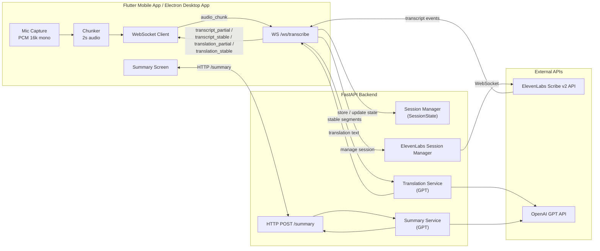
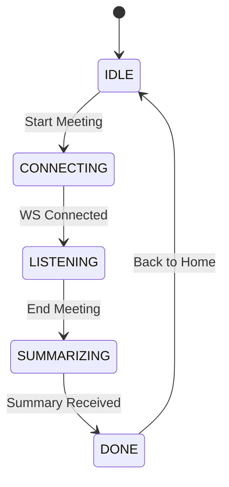

# Architecture & Flow (MVP)

This document describes the **end-to-end architecture** and **runtime flow** of the MeetLens MVP.

Goal: make it easy to reason about how audio goes from the microphone → transcript → translation → summary, and how Flutter (mobile) and Electron app (desktop) frontends interact with FastAPI.

---

## 1. High-Level Architecture

MeetLens MVP consists of:

- **Mobile App (Flutter)** & **Desktop App (Electron)**
    - Captures microphone audio (including what comes from laptop speakers in the room)
    - Chunks audio (e.g., every 2 seconds)
    - Sends audio chunks via WebSocket to backend
    - Receives live transcript & translation via WebSocket
    - Calls HTTP summary endpoint at the end
    - Renders UI: live subtitles, translation, and post-meeting summary
- **Backend (FastAPI)**
    - Exposes WebSocket endpoint `/ws/transcribe`
    - Exposes HTTP endpoint `POST /summary`
    - Manages per-session state ([SessionState](../api/CONTRACT.md#session-state-internal))
    - Forwards audio chunks to **ElevenLabs Scribe v2 Realtime API** via WebSocket
    - Receives partial and committed transcripts from ElevenLabs (built-in transcript merging)
    - Sends stable segments to translation (OpenAI GPT)
    - Streams `transcript_partial`, `transcript_stable`, `translation_partial`, and `translation_stable` back to the client
    - Generates meeting summary at the end using OpenAI GPT
- **External AI Services**
    - **ElevenLabs Scribe v2 Realtime API** (Speech-to-Text via WebSocket)
    - **OpenAI GPT** (translation + summary)

---

## 2. High-Level Diagram (Mermaid)



---

## 3. Runtime Flow – Step by Step

### 3.1. Start of Meeting

1. **User opens MeetLens** and taps **"Start Meeting"**.
2. Flutter app (mobile) or Electron app (desktop):
    - Requests microphone permission if not already granted.
    - Generates a `session_id` (UUID v4).
    - Opens a WebSocket connection to `/ws/transcribe`.
3. When WS connection is established, client enters **LISTENING** state.

---

### 3.2. Audio Capture & Chunking (Client)

1. Flutter app (mobile) or Electron app (desktop) starts **continuous microphone capture** in 16 kHz mono PCM format.
2. A timer (or stream transformer) groups audio into **2-second chunks**.
3. For each chunk:
    - Convert raw bytes to Base64 string.
    - Increment `chunk_id` (1, 2, 3, ...).
    - Send `audio_chunk` message over WebSocket:
    
    ```json
    {
      "type": "audio_chunk",
      "session_id": "<uuid>",
      "chunk_id": 1,
      "audio_format": "pcm_s16le_16k_mono",
      "data": "BASE64_AUDIO"
    }
    
    ```
    
4. The app continues to send chunks until the user taps **"End Meeting"**.

---

### 3.3. WebSocket Handling & Session State (Backend)

1. When a client connects to `/ws/transcribe`, backend:
    - Creates (or retrieves) a `SessionState` for the `session_id`.
2. For each `audio_chunk`:
    - Base64 decode → `bytes`
    - Forward to **ElevenLabs Session Manager**
    - ElevenLabs Session Manager maintains a separate WebSocket connection to ElevenLabs Scribe v2 API
    - Sends audio chunk to ElevenLabs
3. ElevenLabs returns events:
    - `partial_transcript` - interim transcription
    - `committed_transcript` - finalized segments
4. Backend forwards these events to client:
    - `partial_transcript` → `transcript_partial` message
    - `committed_transcript` → `transcript_stable` message
5. For each `committed_transcript` (stable segment):
    - Send it to **TranslationService**.
    - TranslationService calls OpenAI GPT to translate that segment.
    - As translation completes, send `translation_partial` messages for **live preview**.
    - When the translation is finalized → send a `translation_stable` message for that segment.

---

### 3.4. ElevenLabs Integration (Current Implementation)

**Note**: The MVP uses ElevenLabs Scribe v2 Realtime API instead of the originally planned OpenAI Whisper + custom TranscriptMerger approach.

**Why ElevenLabs?**
- Built-in real-time streaming with WebSocket support
- Lower latency than batch-based Whisper API
- Automatic transcript merging and stabilization
- Partial and committed transcript events out-of-the-box

**Flow:**
1. Backend maintains a WebSocket connection to ElevenLabs for each meeting session
2. Audio chunks are forwarded directly to ElevenLabs
3. ElevenLabs handles:
   - Speech-to-text conversion
   - Chunk overlap and deduplication
   - Sentence boundary detection
   - Partial vs. stable transcript classification
4. Backend acts as a transparent proxy, forwarding events to the client

**Alternative Implementation Available:**
- [services/whisper_service.py](../../services/whisper_service.py) contains a complete OpenAI Whisper implementation
- [services/transcript_merger.py](../../services/transcript_merger.py) contains custom overlap detection and merging logic
- These are available if ElevenLabs becomes unavailable or for cost optimization

---

### 3.5. Translation Flow

1. Every time a stable segment is received from ElevenLabs, backend calls **TranslationService**.
2. TranslationService:
    - Builds a short prompt for GPT: "Translate this sentence from [source_lang] to [target_lang]".
    - Sends the segment to GPT.
    - Receives translated text.
3. Backend streams translation updates over WebSocket:

    - **Preview:** `translation_partial` (overwrites the previous preview for the same segment)
    - **Finalized:** `translation_stable` (appends to stable translation log and clears preview)

4. Client shows the `translation_partial` text as a live preview and appends `translation_stable` segments to the finalized translation view.

**Note on Full Retranslation:**
In some cases (e.g., when ElevenLabs revises previous transcript segments), the backend may retranslate the entire accumulated transcript to maintain consistency. This ensures translation accuracy but may increase API costs for longer meetings.

---

### 3.6. End of Meeting & Summary

1. User taps **"End Meeting"** in the app.
2. Client:
    - Stops microphone capture.
    - Stops sending new `audio_chunk` messages.
    - Sends a final `end_session` message over WebSocket:
    
    ```json
    {
      "type": "end_session",
      "session_id": "<uuid>"
    }
    
    ```
    
3. Backend closes the ElevenLabs WebSocket connection for this session.
4. The app now has the full `stableTranscript` string locally.
5. Client calls `POST /summary` with:
    
    ```json
    {
      "session_id": "<uuid>",
      "full_transcript": "...full merged transcript...",
      "language": "tr"
    }
    
    ```
    
6. Backend SummaryService:
    - Builds a structured summarization prompt for GPT.
    - Asks GPT to produce:
        - Short overview (2–5 sentences)
        - Action items (bullet list)
        - Decisions (bullet list)
    - Returns `SummaryResponse`.
7. Client navigates to **Summary Screen** showing:
    - Full transcript (scrollable)
    - Summary overview paragraph
    - Action items list
    - Decisions list

---

## 4. Client State Machine (Simplified)



- **IDLE**: App is on home screen.
- **CONNECTING**: WebSocket being established.
- **LISTENING**: Audio capture + chunk streaming + live transcript/translation.
- **SUMMARIZING**: Waiting for `/summary` HTTP response.
- **DONE**: Summary shown.

---

## 5. Backend Components

### 5.1. WebSocket Controller

Responsibilities:

- Handle connection open/close
- Parse incoming JSON messages
- Route `audio_chunk` and `end_session` to appropriate services
- Stream back `transcript_*` and `translation_*` messages

### 5.2. Session Manager

Responsibilities:

- Maintain in-memory `SessionState` for each `session_id`
- Provide basic API: `get_or_create(session_id)`
- Track full transcript and translation state
- Optionally clean up old sessions after timeout

### 5.3. ElevenLabs Session Manager (Current)

Responsibilities:

- Manage WebSocket connections to ElevenLabs Scribe v2 API
- One connection per meeting session
- Forward audio chunks to ElevenLabs
- Receive and process transcript events (partial_transcript, committed_transcript)
- Map ElevenLabs events to MeetLens message format

### 5.4. Whisper Service (Alternative - Not Used in MVP)

Responsibilities:

- Take raw audio bytes + `audio_format`
- Call OpenAI Whisper API
- Return recognized text

**Status**: Fully implemented but not used in MVP. Available as fallback option.

### 5.5. TranscriptMerger (Alternative - Not Used in MVP)

Responsibilities:

- Maintain text consistency across audio chunks
- Avoid duplicates / splits using tail word overlap detection
- Detect stable segments (sentences) using punctuation and boundaries

**Status**: Fully implemented but not used in MVP. ElevenLabs provides built-in merging.

### 5.6. Translation Service

Responsibilities:

- Take stable segment and language info
- Call OpenAI GPT to translate
- Return translated text
- Handle both incremental and full retranslation scenarios

### 5.7. Summary Service

Responsibilities:

- Take full transcript (string)
- Build summarization prompt
- Call OpenAI GPT
- Return structured summary object

---

## 6. Non-Functional Considerations (MVP)

- **Latency:**
    - Current: transcript/translation appears within ~1–2 seconds with ElevenLabs
    - ElevenLabs provides lower latency than batch-based Whisper
- **Stability:**
    - The system handles 30–60 minutes of continuous meeting without crashing
    - ElevenLabs WebSocket connection is stable and auto-recovers from errors
- **Error Handling:**
    - If a chunk fails, log it and continue with the next chunks
    - If summary fails, show a graceful fallback in the app (e.g., transcript only)
    - ElevenLabs errors are forwarded to client with appropriate error codes
- **Scalability:**
    - MVP is single-user / low-traffic; no heavy scaling required yet
    - In-memory session storage is sufficient
    - No authentication or multi-tenancy

---

## 7. Future Extensions (Architecture Hooks)

The current architecture allows for future improvements without major redesign:

- **Add authentication** (tokens attached to WS + HTTP calls) - database schema ready
- **Add usage tracking** and per-user rate limiting
- **Replace in-memory `SessionState`** with Redis for horizontal scaling
- **Switch to Whisper** for cost optimization (using existing whisper_service.py)
- **Add custom TranscriptMerger** for fine-tuned control (using existing transcript_merger.py)
- **Support on-device Whisper** for "Pro/Offline" mode
- **Add diarization** by plugging a speaker-detection model
- **Meeting persistence** in database (transcripts, summaries, metadata)
- **Export functionality** (PDF, DOCX, etc.)

For now, the MVP architecture is intentionally **simple, linear, and focused** on proving the core experience:

> Phone on the table → live transcript + translation → clear summary at the end.
